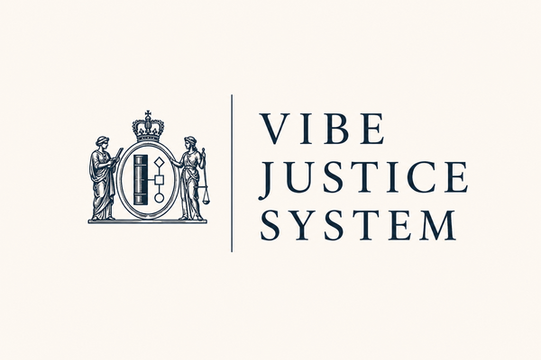

<div align="center">



# Vibe Justice System

*AI governance for your repo. The court is AI. Not legal advice.*


</div>

> **Disclaimers**
> - **Not a real court. Not legal advice.** VJS is an AI governance framework. Rulings are AI outputs, not legal instruments.
> - **Production systems need real engineers.** VJS helps record and structure AI decisions - it does not replace qualified engineering review, security audit, or human sign-off on anything that matters in the real world.
> - **It only refines what you give it.** Rulings are only as good as the spec and context you provide. Garbage in, garbage out. A weak spec produces weak law.

> **Known limitations (alpha)**
> - **Citation numbering is deterministic.** The next neutral citation is computed from the citator, not guessed: run `cdd next-citation <tier>` (CLI), and the three court Workflows now auto-assign the next `[YEAR] LEXBY-<TIER> N` from `.justice/INDEX.md` at ruling time. (Numbers are still confirmed when the ruling is committed to the citator.)
> - **CLI shipped; npm/PyPI publish pending.** A zero-dependency Node CLI lives in [`cli/`](cli/) (`cdd` / `vjs`: `init`, `next-citation`, `submit-request`, `submit-breach`). Install locally with `npm link ./cli` (or run `node cli/bin/cdd.js`). Publishing to a registry is the remaining packaging step.

---

**The biggest barrier to success is being able to define correctness. This repo solves it.**

---

Your AI makes decisions every session. Nobody writes them down. Six PRs later, a different session contradicts the first one. Now you have two conventions, zero explanation, and a codebase that has lost the plot.

**VJS gives your AI a justice system.** Decisions become binding precedent. Past rulings are checked before anything new is done. If the AI breaks its own rules, it must self-report and fix it.

---

## Lexby

Your AI counsel. Three things at once:

- **ADVOCATE** - builds the strongest case for your idea and argues hard for it, because he doesn't decide the outcome
- **ADVISOR** - gives it to you straight; if your idea has a fatal flaw he names it before the judges do
- **ENGINEER** - ships the code, then records why

The separation matters. Lexby argues the case but does not sit on the bench - he cannot tip the outcome and then quietly do the opposite. The court decides independently. Lexby executes. The record is permanent.

---

## How it works

Every time you use AI to build something, it makes silent calls: which approach, which trade-off, which direction. Most never get written down. Then a new session picks a different direction, and now nothing is consistent.

VJS catches those calls and turns them into binding decisions:

1. The AI hits a choice - "build this ourselves or use the library?", "ship now or wait for the audit?"
2. Lexby checks if that type of choice was already decided. If yes: follows the ruling instantly - no deliberation, same answer every time, for the life of the project.
3. If not: an AI court deliberates and issues a ruling. It gets committed to the repo.
4. Every future session inherits it. The AI cannot contradict its own record. If it does, it must self-report and go back to court.

**When the AI gets something wrong, it must report itself and fix it.**

### Brownfield code

If you are installing VJS on an existing codebase, the best practice is to start a fresh repo. Treat the brownfield site as requirements: read it, extract what it does and why, and use that as the input to your spec. Then build green, with VJS governing every decision from day one. Trying to retrofit a justice system onto undocumented history is harder than building clean from known requirements - and the brownfield code already contains the answers you need.

---

## The courts

```
FIRST INSTANCE       1 AI judge                        Everyday decisions. Repo only.
COURT OF APPEAL      3 AI judges                       Disputed calls. Repo only.
SUPREME COURT      5 AI judges (9 for big calls)     Foundational. Repo + community record.
```

Start at First Instance. Escalate by permission. You can't skip.

First Instance and Court of Appeal rulings live in your repo under `.justice/judgments/` and go nowhere else - they are yours. Supreme Court rulings are also committed to your repo, and additionally submitted anonymised to the shared community record so every other VJS project can benefit from the reasoning.

Most things never leave First Instance - one judge, a ruling, a permanent citation (`[2026] LEXBY-FI 1`). Higher courts are for contested calls, overturning a ruling, or questions foundational enough that every future VJS project should inherit the answer.

---

## Say this to Lexby

```
"I think we should go this way. Submit it to the court."

"I don't agree with the outcome. Can we appeal?"

"What did we decide about X, and why?"

"Is this allowed under our spec?"
```

Lexby also catches himself:

```
"I'm not sure this is right..."         -> self-files for a ruling before proceeding

"I think I broke the rules earlier..."  -> self-reports the breach and orders a fix

"I didn't follow what we decided..."    -> files it, finds the original ruling, corrects course
```

Natural language. No syntax. Lexby handles the filing.

---

## Community

VJS is building shared precedent for AI-assisted work.

When your Supreme Court rules on something, that ruling gets submitted anonymised to the community record. What gets stripped: your repo name, file paths, function names, variable names - anything that identifies your project. What gets kept: the question that was asked, the facts of the decision, the ruling itself, and the law applied. You share the reasoning, not the source.

**The more Supreme Court rulings go in, the faster every project resolves.** Here is why: before any court sits, Lexby checks the community precedent index first. If someone else already fought this battle and got a ruling, the fast-path disposes of the matter on citation with no sitting. The bigger the community record gets, the more questions get answered instantly. It's the network effect of a legal commons: every ruling contributed is free advice to every future project that hits the same fork.

> **Fast path:** Project A ruled: *"always encrypt tokens at rest, even in dev."*
> Six months later, Project B hits the same question.
> Lexby finds the ruling. Done in seconds. No court needed.

> **Supreme Court:** Project C has a hard call - should AI ever modify the database schema directly?
> Five judges deliberate. They rule: no, always generate a migration for human review.
> That ruling is anonymised and submitted to the community record.
> Now every VJS project in the world gets that answer on the fast path. Forever.

---

## Ship it

You built the thing. The AI helped. Nobody knows who decided what.

Now you have a record.
Now you have precedent.
Now you have Lexby.

Ship fast. The court is in session.

---

**To install, give your AI this prompt:**

```
Install VJS into this repo. From github.com/wlilley93/vibe-justice-system, fetch and save:
- plugin/CLAUDE.md -> append to this repo's CLAUDE.md
- SPEC-LAW.md -> .justice/SPEC-LAW.md
- VPR.md -> .justice/VPR.md
- .justice/suites/security.md -> .justice/suites/security.md
- .justice/suites/refactoring.md -> .justice/suites/refactoring.md
- plugin/skills/submit-request-to-court/SKILL.md -> .claude/skills/submit-request-to-court/SKILL.md
- plugin/skills/submit-breach-to-court/SKILL.md -> .claude/skills/submit-breach-to-court/SKILL.md
Create .justice/ directories: judgments/high-court, judgments/appeals-court,
judgments/supreme-court, suites. Create .justice/INDEX.md (empty citator).
VJS is now active.
```

Paste that into any Claude conversation in your repo. The AI fetches everything, wires its own behaviour, and installs the `/submit-request-to-court` and `/submit-breach-to-court` slash commands. No other setup needed.

For the full technical reference: [court/README.md](court/README.md)

---

<div align="center">

*VJS is open source. MIT licensed. Contributions, bench rosters, statute packs, and landmark cases welcome.*

*The court structure and procedure draw from the tradition of common law courts. Names on the bench are inventions - never real sitting or living jurists.*

</div>
